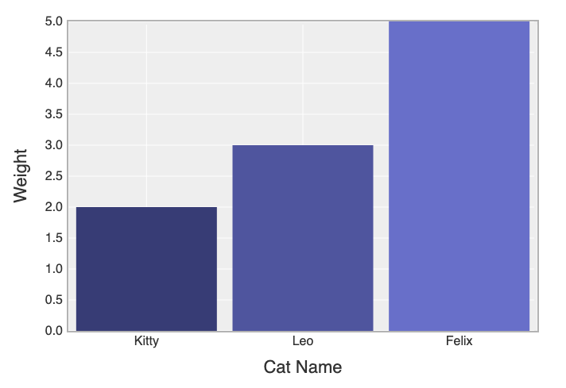

> Bài viết này dịch từ bài gốc - [What is A Matrix & How to Use It in Ruby?](https://www.rubyguides.com/2019/01/ruby-matrix/)

Một ma trận là một mảng 2 chiều (2-dimensional) mà có thể dùng để lưu và làm việc với những dữ liệu dạng bảng tính.

Chúng có thể dùng cho:
- Biểu điện một bảng
- Thống kê và phân tích dữ liệu
- Vẽ biểu đồ và đồ thị

Bởi vậy đây là một cấu trúc dữ liệu mạnh mẽ, hữu ích giúp chúng ta học cách sử dụng chúng.

### Cách tạo ma trận trong Ruby

Ma trận tạo ra bởi nhiều mảng.

Vd:

```
matrix = [[1,2,3], [4,5,6], [7,8,9]]
```

Với code trên sẽ tạo ra ma trận 3x3 và đây là lựa chọn tốt nếu muốn lưu dữ liệu 2 chiều như bảng hoặc tập các vị trí.

Nếu như muốn kết hợp ma trận qua phép cộng, trừ hoặc nhân ma trận, class `Maxtrix` của Ruby có thể giúp việc đó.

Dưới đây là cách để sử dụng class của Ruby.

```
require "matrix'

a = Matrix[[1,2,3], [4,5,6], [7,8,9]]
b = Matrix[[1,2,3], [4,5,6], [7,8,9]]
```

Bây giờ có thể cộng chúng với nhau:

```
a + b
# Matrix[[2, 4, 6], [8, 10, 12], [14, 16, 18]]
```

Có thể lấy các giá trị phần tử như sau: 

```
a[0, 1]
=> 2
```

Đây là `khác biệt với mảng` mà cách truy cập của nó là:

```
matrix[0][1]
```

Cả mảng và ma trận có thể chuyển vị có nghĩa là các hàng thành các cột và các cột thành các hàng.

Vd:

```
matrix.transpose
=> [[1, 4, 7], [2, 5, 8], [3, 6, 9]]
```

**Chú ý:**
Biến ma trận là bất biến vậy không thể đổi giá trị của nó mà không tạo ma trận mới. Lớp `Matrix` này hay dùng cho việc tính toán, nếu muốn phân tích dữ liệu hay thống kê thì cần dùng thứ gì đó khác mạnh hơn nữa.

### Daru Gem

Daru là một gem cho phép làm việc với các ma trận, lấy thống kê từ chúng và in nó thành một bảng với format đẹp hơn. Daru cũng có thể tích hợp với gem vẽ đồ thị Ruby vậy có thể vẽ đồ thị hoặc biểu đồ từ dữ liệu đang có.

Vd:
```
require "daru"
df = Daru::DataFrame.new(
    {
      "A" => [1,2,3],
      "B" => [4,5,6],
      "C" => [7,8,9]
    },
     index: ["A", "B", "C"]
   )
```

Code trên sẽ trả về kết quả như sau:

```
=> #<Daru::DataFrame(3x3)>
       A   B   C
   A   1   4   7
   B   2   5   8
   C   3   6   9
```
- Dể truy cập một cột cụ thể 
```
df["A"]
=> #<Daru::Vector(3)>
       A
   A   1
   B   2
   C   3
```
- hoặc bởi chỉ số:
```
df[0]
=> #<Daru::Vector(3)>
       A
   A   1
   B   2
   C   3
```
- Để thống kê có thể làm như sau:
```
df["B"].describe
=> #<Daru::Vector(5)>
            statistics
      count          3
       mean        5.0
        std        1.0
        min          4
        max          6
```
- Đến đây là chưa hết vì còn có một điểm thú vị nữa đó là tải dữ liệu trực tiếp từ file `CSV, ActiveRecord, Excel`.

Vd:
```
df = Daru::DataFrame.from_csv('baby_names.csv')
=> #<Daru::DataFrame(19418x6)>
            Year of Bi     Gender  Ethnicity Child's Fi      Count       Rank
          0       2016     FEMALE ASIAN AND      Olivia        172          1
          1       2016     FEMALE ASIAN AND       Chloe        112          2
          2       2016     FEMALE ASIAN AND      Sophia        104          3
          3       2016     FEMALE ASIAN AND        Emma         99          4
          4       2016     FEMALE ASIAN AND       Emily         99          4
          5       2016     FEMALE ASIAN AND         Mia         79          5
          6       2016     FEMALE ASIAN AND   Charlotte         59          6
          7       2016     FEMALE ASIAN AND       Sarah         57          7
          8       2016     FEMALE ASIAN AND    Isabella         56          8
          9       2016     FEMALE ASIAN AND      Hannah         56          8
         10       2016     FEMALE ASIAN AND       Grace         54          9
         11       2016     FEMALE ASIAN AND      Angela         54          9
         12       2016     FEMALE ASIAN AND         Ava         53         10
         13       2016     FEMALE ASIAN AND      Joanna         49         11
         14       2016     FEMALE ASIAN AND      Amelia         44         12
        ...        ...        ...        ...        ...        ...        ...
```
- `where` là biểu thức đề lọc dữ liệu.
Nếu muốn tìm tất cả các hàng trong ma trận có `Count` nhỏ hơn `50`.

```
df.where(df['Count'].lt(50))
=> #<Daru::DataFrame(16286x6)>
            Year of Bi     Gender  Ethnicity Child's Fi      Count       Rank
         13       2016     FEMALE ASIAN AND      Joanna         49         11
         14       2016     FEMALE ASIAN AND      Amelia         44         12
         15       2016     FEMALE ASIAN AND      Evelyn         42         13
         16       2016     FEMALE ASIAN AND        Ella         42         13
         17       2016     FEMALE ASIAN AND        Arya         42         13
         18       2016     FEMALE ASIAN AND      Ariana         40         14
         19       2016     FEMALE ASIAN AND        Maya         39         15
         20       2016     FEMALE ASIAN AND       Alina         39         15
         21       2016     FEMALE ASIAN AND       Fiona         35         16
         22       2016     FEMALE ASIAN AND      Ashley         34         17
         23       2016     FEMALE ASIAN AND       Anaya         34         17
         24       2016     FEMALE ASIAN AND      Fatima         34         17
         25       2016     FEMALE ASIAN AND        Anna         34         17
         26       2016     FEMALE ASIAN AND        Aria         33         18
         27       2016     FEMALE ASIAN AND     Abigail         32         19
        ...        ...        ...        ...        ...        ...        ...
```

- Còn có sắp xếp - sort, nhóm - group_by và tổng hợp dữ liệu - aggregate.

```
df = Daru::DataFrame.new(
    { 
      str: %w(a b c d a),
      num: [52,12,7,17,1] 
    }
  )
=> #<Daru::DataFrame(5x2)>
     str num
   0   a  52
   1   b  12
   2   c   7
   3   d  17
   4   a   1

df.group_by(:str).aggregate(num: :sum)
=> #<Daru::DataFrame(4x1)>
     num
   a  53
   b  12
   c   7
   d  17
```

### Vễ đồ thị với Daru
Daru cho phép biểu diễn dữ liệu và xuất ra HTML file.

Vd:

```
df = Daru::DataFrame.new(
  {
    'Cat Names' => %w(Kitty Leo Felix),
    'Weight'   => [2,3,5]
  }
)

=> #<Daru::DataFrame(3x2)>
           Cat Names    Weight
         0     Kitty         2
         1       Leo         3
         2     Felix         5

df.plot(type: :bar, x: 'Cat Names', y: 'Weight') do |plot, _|
  plot.x_label 'Cat Name'
  plot.y_label 'Weight'

  plot.yrange [0, 5]
end.export_html
```

Tiếp đến sẽ tạo một file html cùng thư mục code.

Nếu muốn dùng Daru với ứng dụng Rails cần thêm gem `daru-view`.

<p align="center">
  
</p>

Đến đây là hết. Cảm ơn các bạn đa đọc bài viết của minh 😅🤗

### Tham khảo
- [Daru gem](https://github.com/SciRuby/daru)
- [Daru view gem](https://github.com/SciRuby/daru-view)
